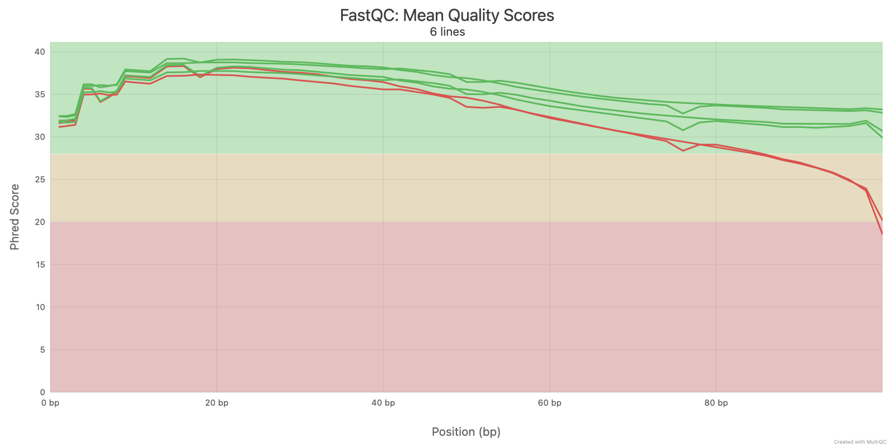
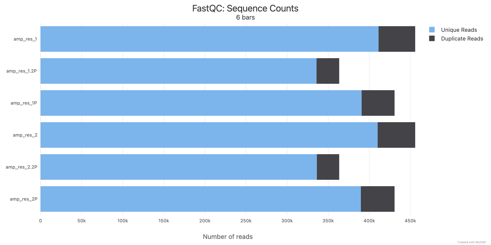
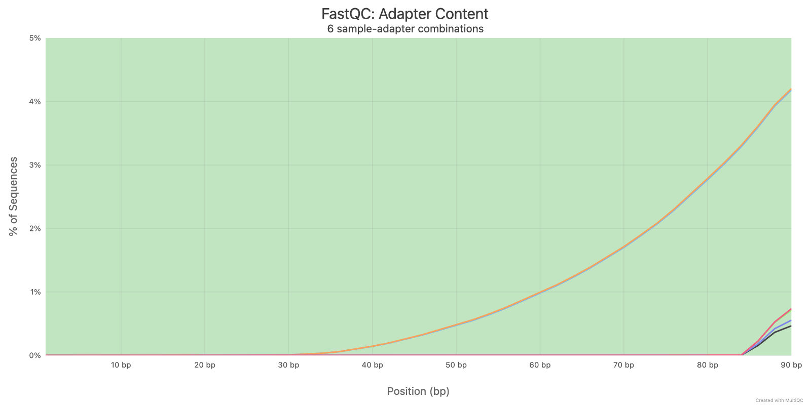
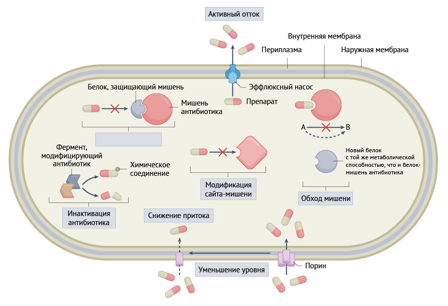
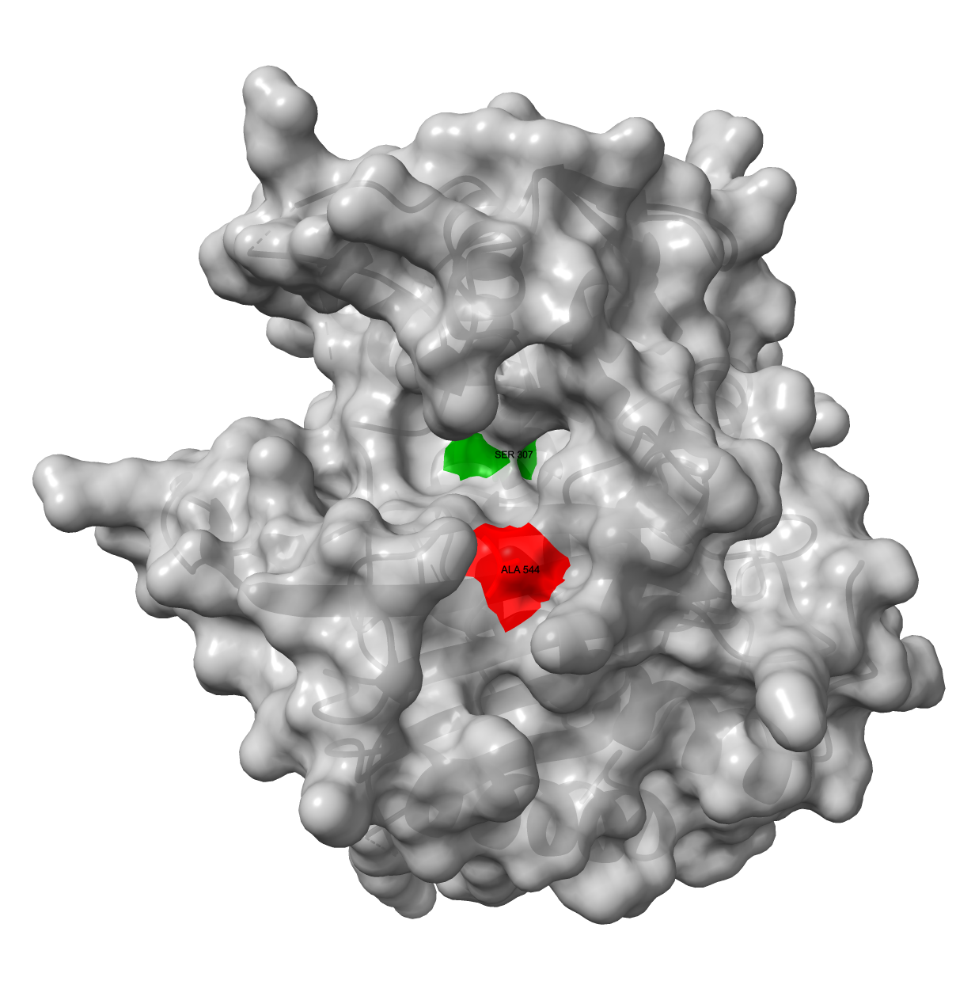

# Prerequisites
### To install all dependencies, you must have [Mamba](https://github.com/conda-forge/miniforge) installed on your system.  

🟢 **Create the environment with the following command and activate it:**
```bash
mamba env create -f environment.yml -n practicum_project_1
mamba activate practicum_project_1
```  

# 1. Where to get the data.
🟢 **Automatic installation of all components:**  
> Run **setup.sh** file.  
```bash
sh setup.sh
```  

# 🟢 Now you can run the **run.sh** file for automatic commands execution.  
```bash
sh run.sh
```  

# 🟡 All subsequent commands will be executed individually.  
⚠️ **if you ran run.sh, you don't need to execute them.**  

# 2. Inspect raw sequencing data manually.  
<details> 
<summary>Show code</summary>

```bash
gunzip -c reads/amp_res_1.fastq.gz | wc -l > reads/reads_wc_stats.txt
gunzip -c reads/amp_res_2.fastq.gz | wc -l >> reads/reads_wc_stats.txt

seqkit stats reads/amp_res_1.fastq.gz > reads/seqsit_stats_output.txt
seqkit stats reads/amp_res_2.fastq.gz >> reads/seqsit_stats_output.txt
```
</details>

🤔 **Task:** *From the line count, use what you know about the fastq format to calculate the number of reads in each file, and record in your lab notebook.*  
✅ **Answer.** Reads count. (To get the number of reads, you should to dovode these numbers by 4.):  
 - amp_res_1.fastq.gz - 1823504  
 - amp_res_2.fastq.gz - 1823504  

# 3. Inspect raw sequencing data with FastQC. Filtering the reads.  
<details> 
<summary>Show code</summary>

``` bash
fastqc -o ./reads/fastqc reads/amp_res_1.fastq.gz reads/amp_res_2.fastq.gz
```
</details>

🤔 **Task:** *Do the basic statistics match what you calculated for the number of reads last time?*  
✅ **Answer:** Yes  

🤔 **Task:** *On the left, you’ll see a navigation window with green (normal), yellow (slightly abnormal), and red (very unusual) circles for several kinds of data analysis. If you have any red circles, record them in your notebook:*  
✅ **Answer:**  
> amp_res_1.fastq.gz: Per base sequence quality, Per tile sequence quality  
> amp_res_2.fastq.gz: Per base sequence quality  

🤔 **Task:** *Mention the QC results in your lab report.*  
✅ **Answer.**  
**FastQC results:**  
> **Per base sequence quality:**  
>> The FastQC analysis revealed a decrease in read quality towards the end of both forward and reverse reads.

> **Per tile sequence quality:**  
>> A significant drop in quality was detected for forward reads in specific tiles of the flow cell (red and yellow areas). Reverse reads also showed regions of reduced quality, but the result is acceptable. Overall, the general result remains acceptable due to the limited and localized nature of these deviations. These issues may have been caused by the presence of a bubble or edge effects in the flow cell.

🤔 **Task:** *What do you think we should do about anything FastQC identified as unusual?*  
✅ **Answer:**
> It depends on the results. In this case, we can remove reads or their parts that do not meet the quality criteria.

# 4. (Optional, 1 bonus point) Filtering the reads. 
<details> 
<summary>Show code</summary>

```bash 
trimmomatic PE -phred33 reads/amp_res_1.fastq.gz reads/amp_res_2.fastq.gz reads/trimmed/amp_res_1P.fastq.gz reads/trimmed/amp_res_1U.fastq.gz reads/trimmed/amp_res_2P.fastq.gz reads/trimmed/amp_res_2U.fastq.gz ILLUMINACLIP:refs/NexteraPE-PE.fa:2:30:10:2:True LEADING:20 TRAILING:20 SLIDINGWINDOW:10:20 MINLEN:20 2> reads/trimmed/trimmomatic.log
fastqc -o ./reads/trimmed/fastqc reads/trimmed/amp_res_1P.fastq.gz reads/trimmed/amp_res_2P.fastq.gz
```  
</details>

📈 **Trimmomatic output:**  
> (Qual=20): Input Read Pairs: 455876 Both Surviving: 430758 (94,49%) Forward Only Surviving: 9340 (2,05%) Reverse Only Surviving: 527 (0,12%) Dropped: 15251 (3,35%)

🤔 **Task:** *What happens if we increase the quality score at all steps to 30? Try to modify the previous command (be sure to name them something distinct, so as not to overwrite your data).*  

<details> 
<summary>Show code</summary>

```bash
trimmomatic PE -phred33 reads/amp_res_1.fastq.gz reads/amp_res_2.fastq.gz reads/trimmed/amp_res_1.2P.fastq.gz reads/trimmed/amp_res_1.2U.fastq.gz reads/trimmed/amp_res_2.2P.fastq.gz reads/trimmed/amp_res_2.2U.fastq.gz ILLUMINACLIP:refs/NexteraPE-PE.fa:2:30:10:2:True LEADING:30 TRAILING:30 SLIDINGWINDOW:10:30 MINLEN:20 2> reads/trimmed/trimmomatic_2.log  
fastqc -o ./reads/trimmed/fastqc reads/trimmed/amp_res_1.2P.fastq.gz reads/trimmed/amp_res_2.2P.fastq.gz
```
</details>

📈 **Trimmomatic output:**  
> (Qual=30): Input Read Pairs: 455876 Both Surviving: 363413 (79,72%) Forward Only Surviving: 33089 (7,26%) Reverse Only Surviving: 24416 (5,36%) Dropped: 34958 (7,67%)

✅ **Answer:**
> **Total Sequences**
> **Before trimming:**
>> amp_res_1.fastq.gz - 455876  
>> amp_res_2.fastq.gz - 455876  

> **After trimming (qual=20):**
>> amp_res_1P.fastq.gz - 430758  
>> amp_res_2P.fastq.gz - 430758

> **After trimming (qual=30):**
>> amp_res_1.2P.fastq.gz - 363413  
>> amp_res_2.2P.fastq.gz - 363413

📊 **MultiQC output:**  
> *Desctiption:*  
> *A comparative analysis of samples before trimming, after trimming with quality = 20, and after trimming with quality = 30 demonstrates an overall improvement in read quality with increasing quality cutoff during trimming (**Plot 1:** the top two lines represent reads with quality cutoff 30, below them with quality cutoff 20, and the bottom ones before trimming).*  
> *However, as the read quality increases, their quantity decreases, as seen in **Plot 2**. We believe that a quality cutoff of 30 is excessive, as it does not lead to a substantial improvement in quality but results in a significant reduction in the number of reads. We would recommend using a quality cutoff of 20.*  

  

> *Desctiption:*
> *Adapter trimming was also performed, which reduced their quantity by approximately 6-8 times, from just over 4% to about 0.5% (**Plot 3**).*


# 5 . Aligning sequences to reference
## 5.1 Index the reference file 
<details> 
<summary>Show code</summary>

```bash
bwa index refs/GCF_000005845.2_ASM584v2_genomic.fna.gz
```
</details>

🤔 **Task:** *Record the command you used in your lab notebook.*  
✅ **Answer:** Look at the command above.

## 5.2 Align your reads
<details> 
<summary>Show code</summary>

```bash
bwa mem refs/GCF_000005845.2_ASM584v2_genomic.fna.gz reads/trimmed/amp_res_1P.fastq.gz reads/trimmed/amp_res_2P.fastq.gz > alignments/alignment.sam 2> alignments/bwa_mem.log
```
</details>

## 5.3. Compress SAM file
<details> 
<summary>Show code</summary>

```bash
 samtools view -Sb alignments/alignment.sam > alignments/alignment.bam 2> alignments/samtools_sam_to_bam.log
 samtools flagstat alignments/alignment.bam > alignments/samtools_flagstat.txt 2> alignments/samtools_flagstat.log
```
</details>

🤔 **Task:** *What percentage of reads are mapped?*  
✅ **Answer:**  
> 860682 + 0 mapped (99.87% : N/A)  
> 860426 + 0 primary mapped (99.87% : N/A)  

## 5.4 Sort and index BAM file
<details>  
<summary>Show code</summary>  

```bash
samtools sort alignments/alignment.bam -o alignments/alignment_sorted.bam 2> alignments/samtools_sort.log
samtools index alignments/alignment_sorted.bam 2> alignments/samtools_index.log
```

We should unzip ref.fasta for IGV:
```bash
gunzip -c refs/GCF_000005845.2_ASM584v2_genomic.fna.gz > refs/GCF_000005845.2_ASM584v2_genomic.fna
```
</details>  

# 6. Variant calling
<details>  
<summary>Show code</summary> 

```bash
samtools mpileup -f refs/GCF_000005845.2_ASM584v2_genomic.fna alignments/alignment_sorted.bam > mpileup/my.mpileup 2> mpileup/mpileup.log
varscan mpileup2snp mpileup/my.mpileup --min-var-freq 0.8 --variants --output-vcf 1 > vcf/VarScan_results.vcf 2> vcf/VarScan_results.log
```
</details>    

# 7. Variant effect prediction
There is nothing to do.

# 8. Automatic SNP annotation
<details>  
<summary>Show code</summary> 

```bash
touch snpEff.config
echo "k12.genome : ecoli_K12" > snpEff.config
gunzip -c data/k12/GCF_000005845.2_ASM584v2_genomic.gbff.gz > data/k12/genes.gbk
snpeff build -genbank -v k12 > data/k12/snpeff_build.txt 2> data/k12/snpeff_build.log
snpeff ann k12 vcf/VarScan_results.vcf > vcf/VarScan_results_annotated.vcf

cat vcf/VarScan_results_annotated.vcf | ./scripts/vcfEffOnePerLine.pl | snpsift extractFields - CHROM POS REF ALT ID FILTER ADP WT HET HOM NC \
"ANN[*].ALLELE" \
"ANN[*].EFFECT" \
"ANN[*].IMPACT" \
"ANN[*].GENE" \
"ANN[*].GENEID" \
"ANN[*].FEATURE" \
"ANN[*].FEATUREID" \
"ANN[*].BIOTYPE" \
"ANN[*].RANK" \
"ANN[*].HGVS_C" \
"ANN[*].HGVS_P" \
"ANN[*].CDNA_POS" \
"ANN[*].CDNA_LEN" \
"ANN[*].CDS_POS" \
"ANN[*].CDS_LEN" \
"ANN[*].AA_POS" \
"ANN[*].AA_LEN" \
"ANN[*].DISTANCE" \
"ANN[*].ERRORS" \
> VarScan_results_annotated.tsv

awk -F'\t' 'NR==1 || $29 == "0"' VarScan_results_annotated.tsv > VarScan_results_annotated_main.tsv
```
</details> 

# Project's tree
<details>  
<summary>Show tree</summary> 

```bash
[ 928]  .
├── [ 23K]  README.md
├── [9.9K]  VarScan_results_annotated.tsv
├── [3.7K]  VarScan_results_annotated_main.md
├── [1.3K]  VarScan_results_annotated_main.tsv
├── [ 384]  alignments
│   ├── [ 87M]  alignment.bam
│   ├── [249M]  alignment.sam
│   ├── [ 67M]  alignment_sorted.bam
│   ├── [ 14K]  alignment_sorted.bam.bai
│   ├── [ 11K]  bwa_mem.log
│   ├── [   0]  samtools_flagstat.log
│   ├── [ 503]  samtools_flagstat.txt
│   ├── [   0]  samtools_index.log
│   ├── [   0]  samtools_sam_to_bam.log
│   └── [   0]  samtools_sort.log
├── [  96]  data
│   └── [ 256]  k12
│       ├── [3.3M]  GCF_000005845.2_ASM584v2_genomic.gbff.gz
│       ├── [ 11M]  genes.gbk
│       ├── [1.2M]  sequence.NC_000913.3.bin
│       ├── [1.5M]  snpEffectPredictor.bin
│       ├── [2.7K]  snpeff_build.log
│       └── [8.6K]  snpeff_build.txt
├── [4.6K]  environment.yml
├── [ 128]  images
│   ├── [ 67K]  ab_resistance.jpg
│   └── [436K]  ftsI.png
├── [ 128]  mpileup
│   ├── [  37]  mpileup.log
│   └── [253M]  my.mpileup
├── [ 411]  multiqc.log
├── [   0]  multiqc.txt
├── [ 928]  multiqc_data
│   ├── [ 518]  fastqc-status-check-heatmap.txt
│   ├── [6.6K]  fastqc_adapter_content_plot.txt
│   ├── [5.8K]  fastqc_per_base_n_content_plot.txt
│   ├── [8.0K]  fastqc_per_base_sequence_quality_plot.txt
│   ├── [8.5K]  fastqc_per_sequence_gc_content_plot_Counts.txt
│   ├── [ 15K]  fastqc_per_sequence_gc_content_plot_Percentages.txt
│   ├── [2.3K]  fastqc_per_sequence_quality_scores_plot.txt
│   ├── [ 206]  fastqc_sequence_counts_plot.txt
│   ├── [2.2K]  fastqc_sequence_duplication_levels_plot.txt
│   ├── [2.4K]  fastqc_sequence_length_distribution_plot.txt
│   ├── [ 67K]  llms-full.txt
│   ├── [ 18K]  multiqc.log
│   ├── [1.8M]  multiqc.parquet
│   ├── [ 313]  multiqc_citations.txt
│   ├── [840K]  multiqc_data.json
│   ├── [1.6K]  multiqc_fastqc.txt
│   ├── [1.1K]  multiqc_general_stats.txt
│   ├── [ 923]  multiqc_samtools_flagstat.txt
│   ├── [  28]  multiqc_software_versions.txt
│   ├── [1.2K]  multiqc_sources.txt
│   ├── [ 239]  multiqc_trimmomatic.txt
│   ├── [ 331]  multiqc_varscan2_summary.txt
│   ├── [ 346]  samtools-flagstat-pct-table.txt
│   ├── [ 306]  samtools-flagstat-table.txt
│   ├── [ 118]  trimmomatic_plot.txt
│   ├── [  54]  varscan2_variant_counts_plot_INDELs.txt
│   └── [  50]  varscan2_variant_counts_plot_SNPs.txt
├── [2.4M]  multiqc_report.html
├── [ 160]  plots
│   ├── [ 94K]  fastqc_adapter_content_plot.png
│   ├── [131K]  fastqc_per_base_sequence_quality_plot.png
│   └── [ 68K]  fastqc_sequence_counts_plot.png
├── [   0]  project_tree.txt
├── [ 256]  reads
│   ├── [ 42M]  amp_res_1.fastq.gz
│   ├── [ 42M]  amp_res_2.fastq.gz
│   ├── [ 192]  fastqc
│   │   ├── [753K]  amp_res_1_fastqc.html
│   │   ├── [657K]  amp_res_1_fastqc.zip
│   │   ├── [754K]  amp_res_2_fastqc.html
│   │   └── [658K]  amp_res_2_fastqc.zip
│   ├── [  18]  reads_wc_stats.txt
│   ├── [ 352]  seqsit_stats_output.txt
│   └── [ 416]  trimmed
│       ├── [ 27M]  amp_res_1.2P.fastq.gz
│       ├── [1.9M]  amp_res_1.2U.fastq.gz
│       ├── [ 38M]  amp_res_1P.fastq.gz
│       ├── [730K]  amp_res_1U.fastq.gz
│       ├── [ 28M]  amp_res_2.2P.fastq.gz
│       ├── [1.7M]  amp_res_2.2U.fastq.gz
│       ├── [ 38M]  amp_res_2P.fastq.gz
│       ├── [ 42K]  amp_res_2U.fastq.gz
│       ├── [ 320]  fastqc
│       │   ├── [766K]  amp_res_1.2P_fastqc.html
│       │   ├── [641K]  amp_res_1.2P_fastqc.zip
│       │   ├── [781K]  amp_res_1P_fastqc.html
│       │   ├── [652K]  amp_res_1P_fastqc.zip
│       │   ├── [767K]  amp_res_2.2P_fastqc.html
│       │   ├── [636K]  amp_res_2.2P_fastqc.zip
│       │   ├── [777K]  amp_res_2P_fastqc.html
│       │   └── [642K]  amp_res_2P_fastqc.zip
│       ├── [ 16K]  trimmomatic.log
│       └── [ 16K]  trimmomatic_2.log
├── [ 384]  refs
│   ├── [4.5M]  GCF_000005845.2_ASM584v2_genomic.fna
│   ├── [  29]  GCF_000005845.2_ASM584v2_genomic.fna.fai
│   ├── [1.3M]  GCF_000005845.2_ASM584v2_genomic.fna.gz
│   ├── [  12]  GCF_000005845.2_ASM584v2_genomic.fna.gz.amb
│   ├── [  98]  GCF_000005845.2_ASM584v2_genomic.fna.gz.ann
│   ├── [4.4M]  GCF_000005845.2_ASM584v2_genomic.fna.gz.bwt
│   ├── [1.1M]  GCF_000005845.2_ASM584v2_genomic.fna.gz.pac
│   ├── [2.2M]  GCF_000005845.2_ASM584v2_genomic.fna.gz.sa
│   ├── [397K]  GCF_000005845.2_ASM584v2_genomic.gff.gz
│   └── [184K]  NexteraPE-PE.fa
├── [3.4K]  run.sh
├── [ 128]  scripts
│   ├── [ 125]  tsv2md.py
│   └── [1.6K]  vcfEffOnePerLine.pl
├── [1018]  setup.sh
├── [  23]  snpEff.config
├── [3.0K]  snpEff_genes.txt
├── [ 28K]  snpEff_summary.html
└── [ 160]  vcf
    ├── [ 373]  VarScan_results.log
    ├── [3.0K]  VarScan_results.vcf
    └── [ 10K]  VarScan_results_annotated.vcf

15 directories, 105 files
```
</details>  

# 🏆 Results
## 🧬 Annotated variants table
| CHROM       |     POS | REF   | ALT   |   ID | FILTER   |   ADP |   WT |   HET |   HOM |   NC | ANN[*].ALLELE   | ANN[*].EFFECT      | ANN[*].IMPACT   | ANN[*].GENE   | ANN[*].GENEID   | ANN[*].FEATURE   | ANN[*].FEATUREID   | ANN[*].BIOTYPE   |   ANN[*].RANK | ANN[*].HGVS_C   | ANN[*].HGVS_P   |   ANN[*].CDNA_POS |   ANN[*].CDNA_LEN |   ANN[*].CDS_POS |   ANN[*].CDS_LEN |   ANN[*].AA_POS |   ANN[*].AA_LEN |   ANN[*].DISTANCE | ANN[*].ERRORS                     |
|-------------|---------|-------|-------|------|----------|-------|------|-------|-------|------|-----------------|--------------------|-----------------|---------------|-----------------|------------------|--------------------|------------------|---------------|-----------------|-----------------|-------------------|-------------------|------------------|------------------|-----------------|-----------------|-------------------|-----------------------------------|
| NC_000913.3 |   93043 | C     | G     |  nan | PASS     |    16 |    0 |     0 |     1 |    0 | G               | missense_variant   | MODERATE        | ftsI          | b0084           | transcript       | b0084              | protein_coding   |             1 | c.1631C>G       | p.Ala544Gly     |              1631 |              1767 |             1631 |             1767 |             544 |             588 |                 0 | nan                               |
| NC_000913.3 |  482698 | T     | A     |  nan | PASS     |    16 |    0 |     0 |     1 |    0 | A               | missense_variant   | MODERATE        | acrB          | b0462           | transcript       | b0462              | protein_coding   |             1 | c.1706A>T       | p.Gln569Leu     |              1706 |              3150 |             1706 |             3150 |             569 |            1049 |                 0 | nan                               |
| NC_000913.3 |  852762 | A     | G     |  nan | PASS     |    14 |    0 |     0 |     1 |    0 | G               | intragenic_variant | MODIFIER        | rybA          | b4416           | gene_variant     | b4416              | nan              |            -1 | n.852762A>G     | nan             |                -1 |                -1 |               -1 |               -1 |              -1 |              -1 |                 0 | nan                               |
| NC_000913.3 | 1905761 | G     | A     |  nan | PASS     |    13 |    0 |     0 |     1 |    0 | A               | missense_variant   | MODERATE        | mntP          | b1821           | transcript       | b1821              | protein_coding   |             1 | c.74G>A         | p.Gly25Asp      |                74 |               567 |               74 |              567 |              25 |             188 |                 0 | nan                               |
| NC_000913.3 | 3535147 | A     | C     |  nan | PASS     |    16 |    0 |     0 |     1 |    0 | C               | missense_variant   | MODERATE        | envZ          | b3404           | transcript       | b3404              | protein_coding   |             1 | c.722T>G        | p.Val241Gly     |               722 |              1353 |              722 |             1353 |             241 |             450 |                 0 | nan                               |
| NC_000913.3 | 4390754 | G     | T     |  nan | PASS     |    15 |    0 |     0 |     1 |    0 | T               | synonymous_variant | LOW             | rsgA          | b4161           | transcript       | b4161              | protein_coding   |             1 | c.756C>A        | p.Ala252Ala     |               756 |              1053 |              756 |             1053 |             252 |             350 |                 0 | WARNING_TRANSCRIPT_NO_START_CODON |

Thus, a total of four missense variants, one synonymous variant, and one intergenic variant were identified.

## 💊🦠 Analysis of the impact of genetic variants on antibiotic resistance
### Mechanisms of Antibiotic Resistance  
  

### ftsI:c.1631C>G (p.Ala544Gly) 
> FtsI (penicillin-binding protein 3, PBP3) is believed to be the primary peptidoglycan (PG) transpeptidase which functions together with the SEDS family protein FtsW to synthesize septal peptidoglycan (sPG) during cell division. Binding of beta-lactam antibiotics to FtsI inhibits FtsI activity and is lethal. [[1](https://ecocyc.org/gene?orgid=ECOLI&id=EG10341)]  

> The ftsI gene encodes a protein of 588 amino acids. The catalytic domain extends from residues 237 to 577 and is the site of the transpeptidase activity responsible for cross-linking the peptidoglycan cell wall. The catalytic domain also binds β-lactam antibiotics, which mimic a transpeptidase substrate and serve as suicide inhibitors by forming a long-lived covalent adduct with the catalytic serine. In particular, the active site contains a universally conserved serine residue (S307) that forms a covalent bond with the peptide substrate during transpeptidation, a reaction that proceeds via an acyl enzyme intermediate. Thus, FtsI is also known as penicillin-binding protein 3 (PBP3). [[2](https://pmc.ncbi.nlm.nih.gov/articles/PMC305773/), [3](https://academic.oup.com/jac/article/71/5/1188/1750675), [4](https://uroweb.ru/article/profil-antibiotikorezistentnosti-uropatogennoi-escherichia-coli-rezultaty-lecheniya), [5](https://science-education.ru/article/view?id=30188)]  

> The p.Ala544Gly variant identified in the ftsI gene is located within the catalytic domain, which spans residues 237 to 577. Amino acid substitutions occurring within the beta-lactam antibiotic binding region are known to reduce antibiotic affinity, thereby functioning through a target site modification mechanism. To evaluate the spatial relationship, we mapped the conserved serine residue at position 307 within the active site, along with the amino acid at position 544, onto the three-dimensional structure of the ftsI [protein](https://www.rcsb.org/structure/6HZQ). This visualization allowed us to assess the proximity of residue 544 to both Ser307 and the active binding site.
>   
> Based on the analysis of the three-dimensional structure, it can be concluded that amino acid residue 544 is situated in close proximity to both the active site and residue 307. This spatial configuration suggests a potential mechanism for reduced binding affinity of beta-lactam antibiotics, ultimately compromising their therapeutic effectiveness.  

### acrB:c.1706A>T (p.Gln569Leu)
> The acrB gene encodes a component of the AcrAB-TolC efflux pump responsible for exporting various antibiotics including fluoroquinolones like ciprofloxacin, macrolides, tetracyclines, chloramphenicol, and some aminoglycosides. Both regulatory mutations increasing acrB expression and missense mutations enhancing pump functionality contribute significantly to multidrug resistance [[3](https://academic.oup.com/jac/article/71/5/1188/1750675), [6](https://science-education.ru/article/view?id=30188), [7](https://pmc.ncbi.nlm.nih.gov/articles/PMC177656/), [8](https://microbiologyjournal.org/acrab-tolc-efflux-pump-mediated-resistance-to-carbapenems-among-clinical-isolates-of-enterobacteriaceae/), [9](https://pmc.ncbi.nlm.nih.gov/articles/PMC10315565/)]. The pump expels antibiotics from the bacterial cell reducing intracellular antibiotic concentration.

### envZ:c.722T>G (p.Val241Gly)
> Mutations in envZ, primarily missense variants, alter the regulatory activity of the sensor kinase affecting outer membrane porin expression (ompF and ompC). This decreases membrane permeability and limits antibiotic entry, particularly for cephalosporins and penicillins, facilitating adaptive resistance [[3](https://academic.oup.com/jac/article/71/5/1188/1750675), [4](https://uroweb.ru/article/profil-antibiotikorezistentnosti-uropatogennoi-escherichia-coli-rezultaty-lecheniya), [10](https://journals.asm.org/doi/10.1128/jb.00172-24)].

**Of significant importance is a study describing the development of carbapenem resistance resulting from the combination of variants in the FtsI, acrB, and envZ genes. While the specific variants reported in that study differ from those identified in our investigation, the variants we detected in these same genes may also potentially contribute to the emergence of carbapenem resistance. This possibility must be taken into account during therapeutic decision-making.** [[3](https://academic.oup.com/jac/article/71/5/1188/1750675)]

### rybA:n.852762A>G, mntP:c.74G>A (p.Gly25Asp), rsgA:c.756C>A (p.Ala252Ala)
> While rybA, mntP, and rsgA lack direct evidence linking them to classic antibiotic resistance, their roles in stress response regulation, metal ion homeostasis, and ribosomal function, respectively, may indirectly support bacterial survival under antibiotic pressure.  
> It should also be noted that the variant rybA:n.852762A>G is located in an intergenic region and does not directly affect the function of any proteins; however, it may potentially influence their expression levels. The variant rsgA:c.756C>A (p.Ala252Ala) is synonymous and does not alter the amino acid sequence of the protein, yet it may also potentially affect the regulation of gene expression.

### Antibiotic resistance summury and treatment recommendations
> Therefore, considering the multiple antibiotic resistance to many common antibiotic classes, I would recommend the following groups and drugs for use:
1. Macrolides (erythromycin, spiramycin)
2. Polymyxins (polymyxin B)
3. Chloramphenicol preparations (chloramphenicol)

### Conclusion
> In conclusion, missense and regulatory mutations in ftsI, acrB, and envZ are principal contributors to antibiotic resistance in E. coli, complicating treatment options. Indirect contributions of other genes enhance adaptive capacity. These insights derive from a broad range of molecular and clinical studies.

